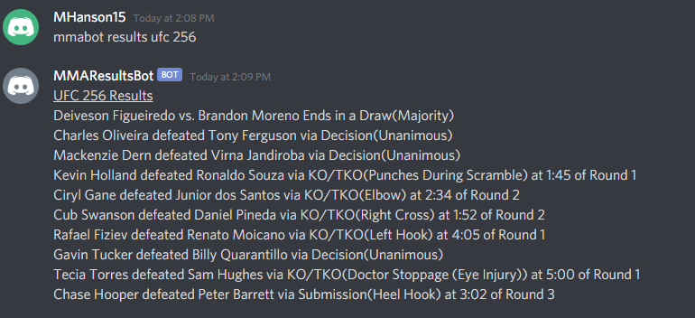

# discord-mma-results
Discord bot that provides results of MMA events using web scraping. Data is scraped from Tapology.com.

## How to Use
1. Create a discord bot and add it to your server. If you don't know how to do this, there is a tutorial [here](https://realpython.com/how-to-make-a-discord-bot-python/).
2. Fill in the .env file with your token and server name
3. Run mmaresultsbot.py
4. To get results type mmabot results and the event name. The bot will provide the results from the first event found. You can also search by main event.

I have configured the bot to only provide results once per minute so tapology does not get overwhelmed but this can be modified by adjusting the LIMIT variable or disabled by commenting out the call to checkLimit.

## Requirements
- discordpy
- python-dotenv
- requests
- BeautifulSoup4
